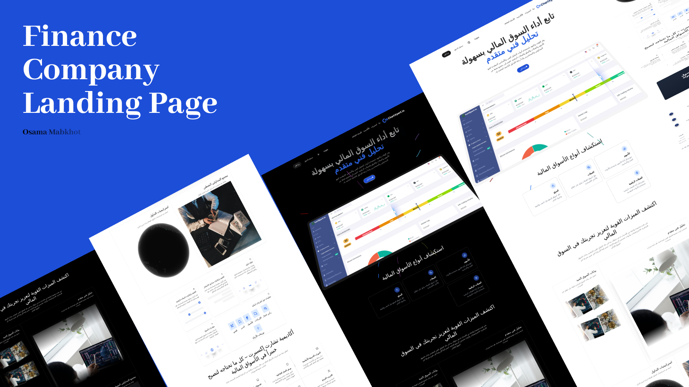

# ChartXpert.io

<p align="center">
  
</p>

<p align="center">
  
  
  

  <br />
  <strong>🚀 A modern, bilingual landing page for a financial charting SaaS platform.</strong>
</p>

<p align="center">
  Built with <strong>React, Three.js, and Aceternity UI</strong>, featuring stunning 3D animations and seamless Arabic & English localization.
</p>

## ✨ Overview

**ChartXpert.io** is the landing page for a fictional financial charting service. This project demonstrates the integration of cutting-edge web technologies to create a high-performance, visually engaging, and globally accessible web presence. It serves as a robust template or a showcase for modern SaaS landing pages.

## 🛠️ Tech Stack

This project is built with a powerful and modern tech stack:

*   **Core Libraries:** [React](https://react.dev/) (inferred from project structure).
*   **3D Graphics:** [Three.js](https://threejs.org/) for immersive web-based 3D animations.
*   **Styling & UI:** [Tailwind CSS](https://tailwindcss.com/) & [Aceternity UI](https://ui.aceternity.com/) for beautiful, customizable components.
*   **Internationalization:** Built-in support for **English** and **Arabic**, including RTL (Right-to-Left) layout adjustments.
*   **Package Manager:** [pnpm](https://pnpm.io/) for fast, efficient dependency management.

## ✨ Key Features

*   **Bilingual Experience:** Full support for English and Arabic with easy language toggling.
*   **Engaging 3D Visuals:** Dynamic Three.js elements that enhance the storytelling without compromising performance.
*   **Responsive Design:** Pixel-perfect display across all devices, from desktops to mobile phones.
*   **Live Chat Integration:** Ready-to-use live chat feature for customer engagement.
*   **Modern UI Components:** Leverages Aceternity UI for smooth animations and a polished look.

## 🚀 Getting Started

Follow these simple steps to get the project up and running on your local machine.

### Prerequisites

*   **Node.js** (version 18 or later recommended)
*   **pnpm** (Install globally with `npm install -g pnpm`)

### Installation & Setup

1.  **Clone the repository**
    ```bash
    git clone https://github.com/O2sa/expert_chart_landingpage.git
    cd expert_chart_landingpage
    ```

2.  **Set up environment variables**
    Create a `.env` file in the root directory. You can use the provided `.env` example file as a template. (Check the repository for specific variable names).

3.  **Install dependencies**
    ```bash
    pnpm install
    ```

4.  **Run the development server**
    ```bash
    pnpm run dev
    ```

5.  **Open your browser**
    Navigate to `http://localhost:3000` (or the port shown in your terminal) to see the website in action.


## 🤝 Contributing

Contributions are what make the open-source community such an amazing place to learn, inspire, and create. Any contributions you make are **greatly appreciated**.

*   If you have a suggestion for improvement, please **fork the repo** and create a pull request.
*   You can also simply open an issue with the tag "enhancement".
*   Don't forget to give the project a star! Thanks again!

1.  Fork the Project
2.  Create your Feature Branch (`git checkout -b feature/AmazingFeature`)
3.  Commit your Changes (`git commit -m 'Add some AmazingFeature'`)
4.  Push to the Branch (`git push origin feature/AmazingFeature`)
5.  Open a Pull Request
